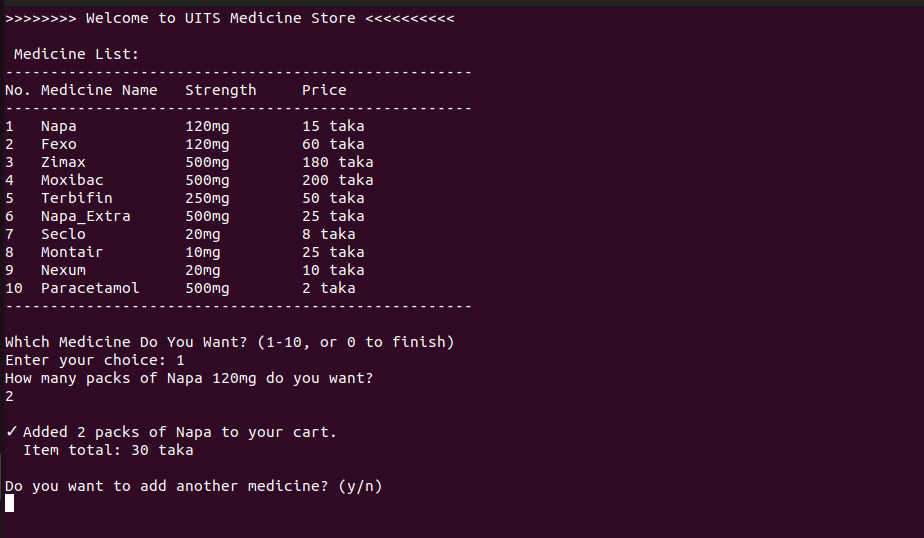
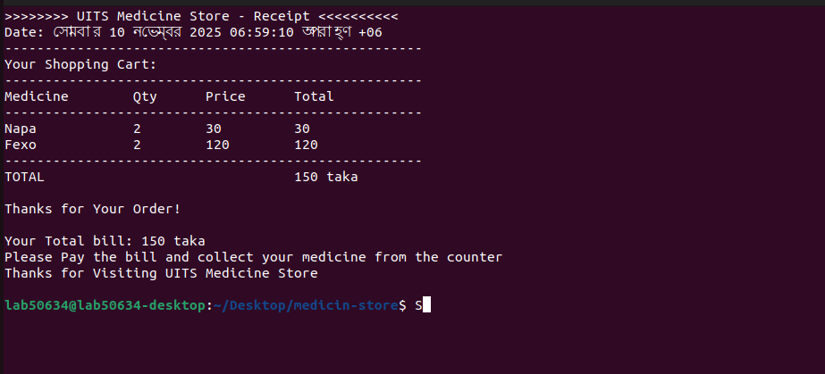

# UITS Medicine Store 🏥💊

A sophisticated Bash script-based medicine store management system with shopping cart functionality, developed for university Linux lab project.

## 📖 Overview

UITS Medicine Store is an enhanced command-line pharmacy management system that allows users to browse medicines, add multiple items to a shopping cart, manage quantities, and automatically calculate the total bill with itemized receipt.

## ✨ Features

- **📋 Medicine Catalog**: Display 10 different medicines with complete details
- **🛒 Shopping Cart**: Add multiple medicines to cart with quantities
- **💰 Real-time Calculation**: Automatic price calculation with itemized billing
- **📄 Detailed Receipt**: Professional receipt with date and item breakdown
- **🔄 Multiple Purchases**: Continue shopping until finished
- **❌ Input Validation**: Handles invalid choices and quantities gracefully
- **🎯 User-Friendly**: Clean, interactive menu-driven interface

## 🗂️ Medicine Inventory

| No. | Medicine | Strength | Price |
|-----|----------|----------|-------|
| 1 | Napa | 120mg | 15 taka |
| 2 | Fexo | 120mg | 60 taka |
| 3 | Zimax | 500mg | 180 taka |
| 4 | Moxibac | 500mg | 200 taka |
| 5 | Terbifin | 250mg | 50 taka |
| 6 | Napa Extra | 500mg | 25 taka |
| 7 | Seclo | 20mg | 8 taka |
| 8 | Montair | 10mg | 25 taka |
| 9 | Nexum | 20mg | 10 taka |
| 10 | Paracetamol | 500mg | 2 taka |

## 🚀 Installation & Usage

1. **Make the script executable:**
```bash
chmod +x medicine_store.sh

## SCREENSHOT OF PROJECT



